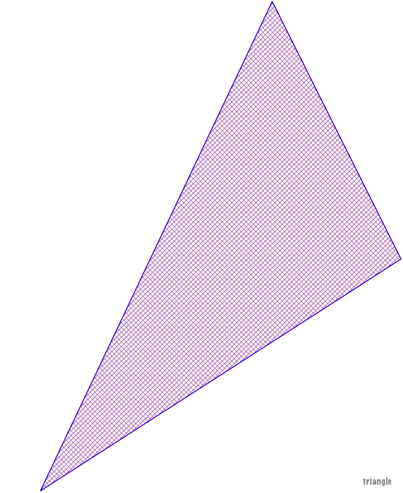
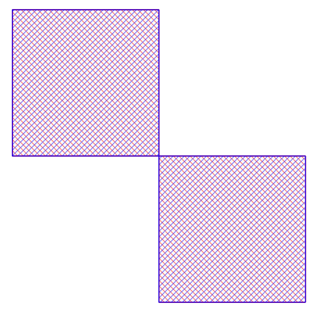
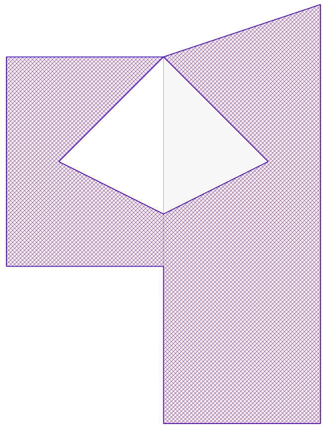
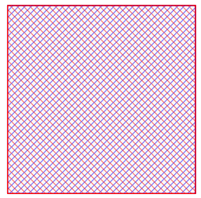
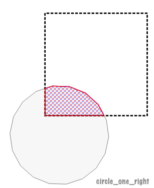
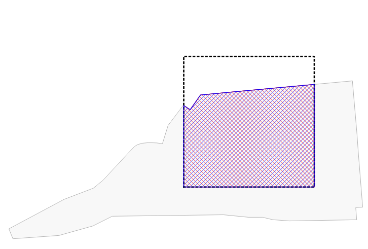
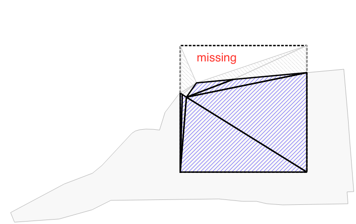

# Testcase Overview

MakeValid tests:

 id |             testcase             |         status             |              image
----|----------------------------------|----------------------------|------------------------------------------
0   | Triangle                         |  `PASS`                          | 
1   | Four Square IO_OI                |  `PASS`                          | 
2   | Four columns invalid multipolygon|   `PASS`                         | 
3   | Square                           | `PASS`                           | 
5   | circle one                       | `PASS`                     | 
6   | circle one right                 | `PASS` | 
7   | irregular polygon middle         | `FAIL:imgage good/Triangulation bad`                     |  
8   | irregular polygon right          | `PASS`       | 

