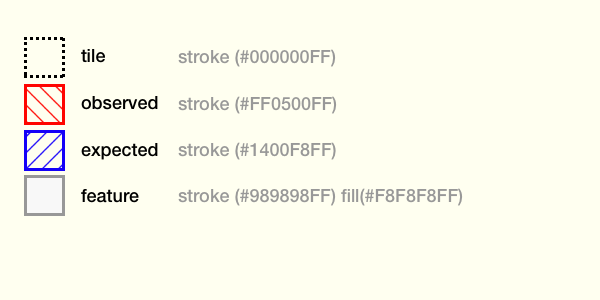

# Testcase Overview

id |testcase | image
---|---|---
0 | Triangle | 
1 | Four Square IO_OI | 
2 | Four columns invalid multipolygon| 
3 | Square | 
4 | circle one gdey | | 
5 | circle one | 
6 | circle one extent modified | 
