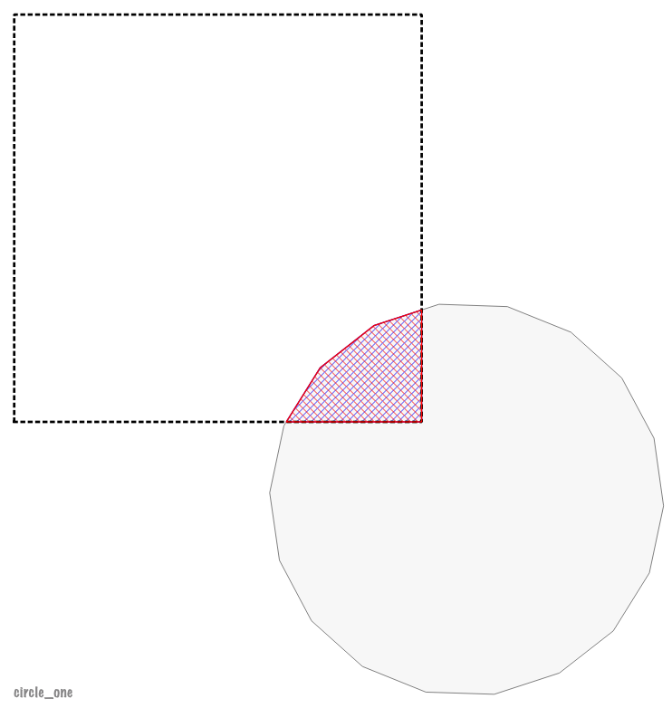

# Testcase Overview

id |testcase | status | image
---|---|---|---
0 | Triangle | |
1 | Four Square IO_OI | |
2 | Four columns invalid multipolygon| |
3 | Square | |
4 | circle one gdey | `FAIL` | 
5 | circle one | `failure locating` |
6 | circle one right | `failure locating` |
7 | irregular polygon middle| `FAIL` |
8 | irregular polygon right | `runtime error` | 